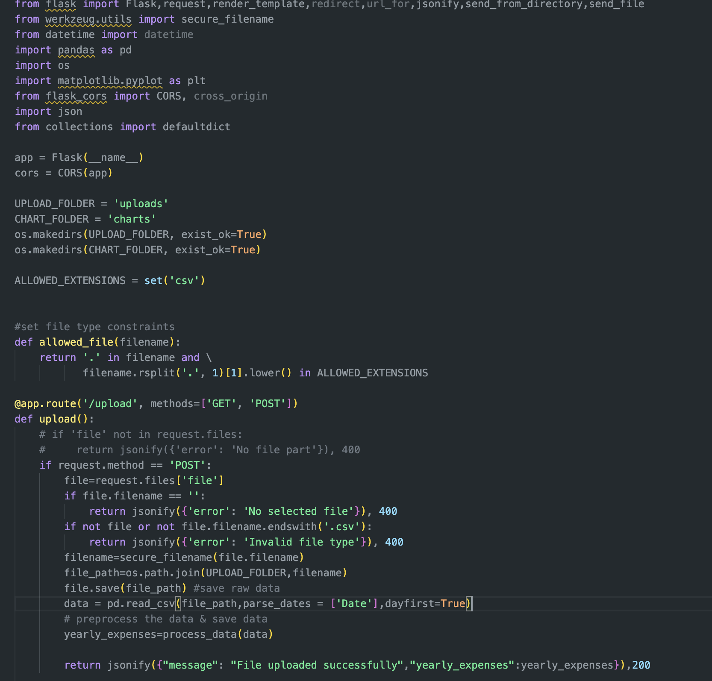
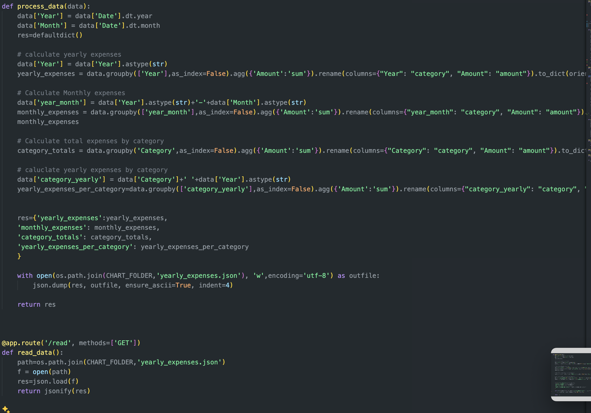
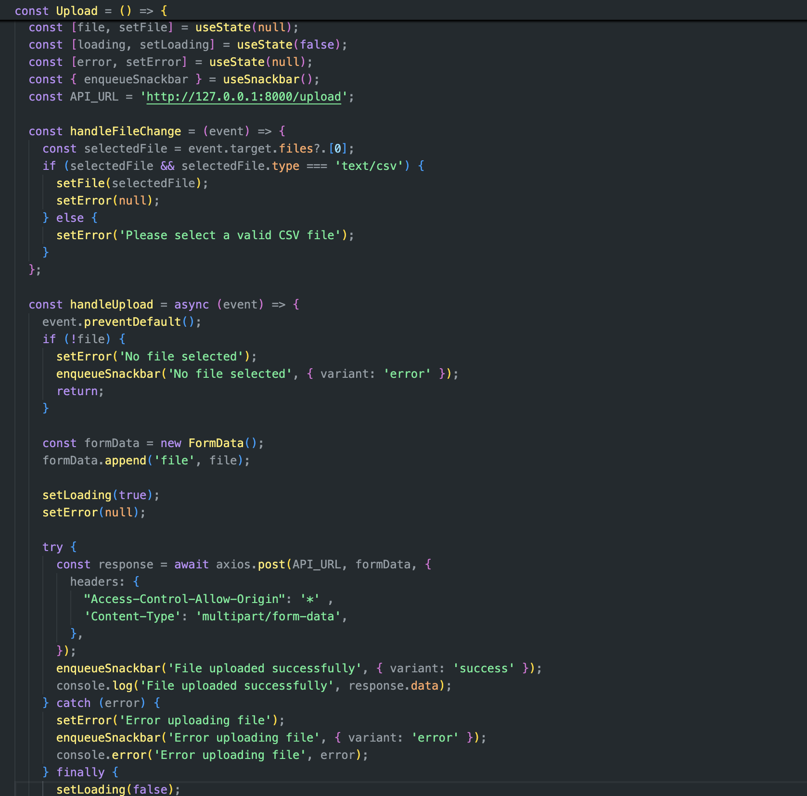
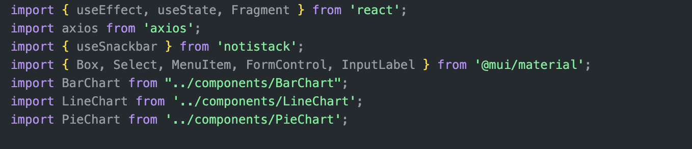

# Code Walkthrough

## Backend (Flask) --> folder flask-server
flask-server/ 
├── charts/
├── node_modules/
├── templates/
├── uploads/
├── .flaskenv
├── app.py
├── package-lock.json
└── package.json

flask-server/app.py

This file initializes the Flask application and sets up Cross-Origin Resource Sharing (CORS). CORS is a security feature implemented by web browsers to control which resources (like fonts, scripts, or XMLHttpRequests) on a web page can be requested from another domain outside the domain from which the resource originated. 

And in this app.py file, it contains the main route for file upload and processing, and data extracting. 

1. When we recieved the CSV file uploaded, it will be store in /uploads folder 

2. the csv content will then be processed data into JSON format, in order to that send by request and display chart views;  data in /charts

## Frontend (React) --> folder client

client/
├── node_modules/
├── public/
├── src/
│   ├── assets/
│   ├── components/
│   │   ├── BarChart.jsx
│   │   ├── LineChart.jsx
│   │   └── PieChart.jsx
│   ├── pages/
│   │   ├── Upload.jsx
│   │   └── ViewChart.jsx
│   ├── utils/
│   ├── App.jsx
│   ├── index.css
│   └── main.jsx
├── .eslintrc.cjs
├── .gitignore
├── index.html
├── package-lock.json
├── package.json
├── README.md
└── vite.config.js

## Working Environemnt set up
├── financial_app_env/

client/src/pages/Upload.jsx
client/src/pages/ViewChart.jsx
This is the main pages that render the file upload form and charts, perspectively.

client/src/components/LineChar.jsx
client/src/components/PieChar.jsx
client/src/components/BarChar.jsx
This is the main components that populate line charts, pie chart and bar chart, perspectively based on chart.js.

# Web architecture 

## Client (Frontend):

Built with React
Handles user interactions and file uploads
Renders charts using react-chartjs-2
Communicates with the server via HTTP requests
Set proxy in package.json for backend communication

## Server (Backend):

Built with Flask
Processes uploaded CSV files
Performs data processing and preparation and chart information
Sends processed data and chart information (yearly_expenses.JSON) back to the client

## Data Flow:
a. User selects a CSV file in the React frontend
b. Frontend sends the file to the Flask backend (via http://127.0.0.1:8000/upload)
c. Backend processes the file, generates charts information data (yearly_expenses.JSON), and sends data back to frontend 
d. By flicking on 'View Summary' button, the front end is sending get request to backend ( via axios to http://127.0.0.1:8000/read ), get th e rpocessed data.
e. Frontend take the processed data, renders the data into charts and displays the processed data

## Technologies Used:

Frontend: React, Chart.js, Axios for HTTP requests
Backend: Flask, Pandas for data processing, Matplotlib for data visualization
Data Format: JSON for data exchange between frontend and backend

## Key Components:

File Upload: Handles CSV file selection and upload
Data Processing: Extracts and analyzes financial data from CSV
Chart Generation: Creates visual representations of the data
Data Display: Renders charts and displays processed information

This architecture allows for a clear separation of concerns, with the frontend handling user interactions and data display, while the backend focuses on data processing and analysis.
